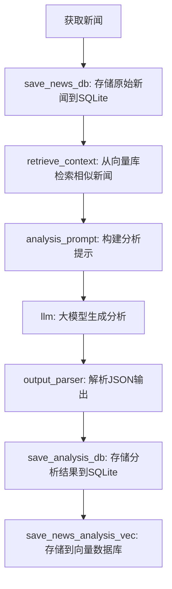

# 🧠 新闻分析系统 (RAG架构)

基于 **RAG (Retrieval-Augmented Generation)** 架构实现的智能新闻分析系统，结合 LangChain 框架、SQLite 持久化存储和 Chroma 向量检索。系统通过检索增强生成技术，将新闻检索与大模型分析能力相结合，提供高质量的新闻分析服务。

## ✨ 核心功能

1. **新闻获取**
   - 通过 NewsAPI 获取每日新闻
   - 支持按时间范围获取新闻
   - 支持关键词搜索新闻

2. **智能分析**
   - 使用 DeepSeek 大模型进行新闻摘要
   - 结构化分析（关键词、实体、情绪、影响）
   - 自动生成主题标签

3. **数据存储**
   - SQLite 数据库持久化存储
   - Chroma 向量存储支持语义检索
   - 支持 JSON 格式存储分析结果

4. **前端展示**
   - Streamlit 构建的现代化界面
   - 新闻列表和详情展示
   - 支持语义搜索和筛选

## 🚀 快速开始

### 环境要求

- Python 3.8+
- NewsAPI 密钥
- DeepSeek API 密钥

### 安装依赖

```bash
pip install -r requirements.txt
```

### 配置

在 `.env` 中配置必要的 API 密钥：

```python
NEWSAPI_KEY = "your_newsapi_key"
DEEPSEEK_API_KEY = "your_llm_api_key"
```

### 命令行使用

系统提供了完整的命令行工具，支持以下功能：


**分析新闻**
```bash
python src/cli.py analyze
```


### 启动 Web 界面

```bash
streamlit run src/web/app.py
```

默认访问地址: http://localhost:8501

## 📊 数据存储结构

### SQLite 数据库

```sql
CREATE TABLE news_articles (
  id TEXT PRIMARY KEY,
  title TEXT NOT NULL,
  source TEXT,
  published_at TEXT,
  content TEXT,
  summary TEXT,
  url Text,
  analysis_result TEXT,  -- JSON 格式，结构化分析结果
  keywords TEXT              -- JSON 格式数组
);
```


## 🔍 RAG 工作流程



### 详细流程说明
1. **save_news_db**
   - 存储原始新闻到SQLite数据库
   - 生成唯一新闻ID
   - 输出: 增强的新闻字典(含ID)

2. **retrieve_context**
   - 从Chroma向量库检索3篇相似新闻
   - 将检索结果作为上下文添加到新闻数据
   - 输出: 带上下文的新闻数据

3. **analysis_prompt**
   - 构建包含新闻内容和上下文的提示词
   - 指定分析要求和输出格式
   - 输出: 格式化的大模型输入

4. **llm**
   - DeepSeek大模型执行分析
   - 生成包含翻译、分析和关键词的JSON
   - 输出: 结构化分析结果

5. **output_parser**
   - 验证和解析大模型输出
   - 确保符合JSON格式要求
   - 输出: 标准化的分析数据

6. **save_analysis_db**
   - 存储分析结果到SQLite
   - 关联到原始新闻ID
   - 输出: 原始新闻数据

7. **save_news_analysis_vec**
   - 将新闻内容+分析结果存入向量库
   - 分割文本为适合检索的块
   - 元数据包含关键词等信息


## 🛠️ 技术栈

- **后端**
  - LangChain: 大模型调用框架
  - DeepSeek: 大模型服务
  - SQLite: 数据持久化
  - Chroma: 向量存储和检索
  - NewsAPI: 新闻数据源
  - Loguru: 日志记录

- **前端**
  - Streamlit: Web 界面
  - Pandas: 数据处理和展示

## 📝 开发计划

- [ ] 支持更多新闻源
- [ ] 优化分析提示词
- [ ] 添加新闻分类功能
- [ ] 实现新闻推荐系统
- [ ] 添加用户反馈机制

## 🤝 贡献指南

欢迎提交 Issue 和 Pull Request 来帮助改进项目。

## 📄 许可证

MIT License